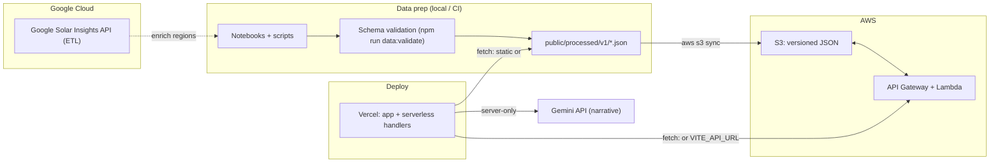

# SolarSense

🏆 **DataHacks 2026 — UI/UX Desgin Track Winner**

**Solar ROI intelligence for cities, utilities, and teams evaluating solar at neighborhood scale.**

**Live app:** [solar-roi-insights.vercel.app](https://solar-roi-insights.vercel.app/)

---

## What it is

SolarSense turns **neighborhood-level adoption and financial assumptions** into decision-ready insight: payback, long-term savings, CO₂ impact, and growth signals—so you can see **where solar wins fastest** and stress-test scenarios (system size, investment, utility inflation). The app pairs a **geospatial view** of regions with a **What-if** model and an optional **AI-generated executive narrative** powered by Gemini API.

---

## How to use (visitors)

1. Open the **[live site](https://solar-roi-insights.vercel.app/)**.
2. Use **Dashboard** to explore regions on the map, compare neighborhoods, and read headline metrics.
3. Adjust **What-if** controls (system size, investment, utility price increase) to see payback and projection curves update.
4. Review **environmental** metrics where shown for reporting-style context.
5. **Generate the AI narrative** (where available) to get a structured brief grounded in the current dataset.
6. Open **Methodology** for how metrics are defined and interpreted.

*Tip for demos:* pick a fast-payback area, then raise **Utility Price Increase** to show downside protection vs grid-only costs.

---

## UI/UX Design

- **Dashboard-first layout** — Key Performance Indices (KPIs) and actions above the fold; scannable for executives and public staff.
- **Consistent design system** — Tailwind CSS + [Radix UI](https://www.radix-ui.com/) primitives for accessible dialogs, toggles, and layout; cohesive typography and color hierarchy.
- **Map + panels** — Geospatial context alongside numeric detail so users never lose place between “where” and “how much.”
- **What-if as a first-class control** — Sliders and inputs tie directly to the projection chart so changes feel immediate and explainable.
- **Methodology page** — Separates *interpretation* from *exploration* so trust and clarity stay high.

This approach is what earned **Best UI/UX** at the event: clear information architecture, low cognitive load, and a path from overview → drill-down → action.

---

## Technical overview

| Layer | Role |
|--------|------|
| **Vite + TanStack Start / Router** | Full-stack React app with typed routes, SSR-friendly shell, and server functions. |
| **Nitro** | Build adapter so the app can deploy as a **production Node bundle** (e.g. Vercel). |
| **React Query** | Client data fetching and cache behavior for API/static JSON. |
| **Recharts + maps (Leaflet / MapLibre)** | Projections, comparisons, and geospatial exploration. |
| **Zod** | Runtime validation (e.g. inputs to server functions). |
| **Processed JSON contract** | `manifest.json`, `summary.json`, `regions.json` — one schema for static fallback and API responses. See `src/types/api.ts` and `data/`. |

---

## Cloud & data flow

The stack is designed to be **scalable, reproducible, and easy to update** without pasting data into the frontend.



- **Static path:** If `VITE_API_URL` is unset, the browser loads `/processed/v1/*` from the deployment (Vite `public/`).
- **API path:** If `VITE_API_URL` points to your **API Gateway** base (no trailing slash), the app calls `/api/summary`, `/api/regions`, `/api/manifest` — typically backed by **Lambda** reading from **S3**.
- **S3 sync:** `npm run data:publish` (see `data/scripts/publish-processed.sh`) syncs `public/processed/v1/` to a bucket; pair with a matching backend `DATA_BUCKET`.
- **Validation:** `npm run data:validate` enforces the same shapes as the TypeScript types — a reliability gate before publish.

More detail: `data/README.md`.

---

## Gemini API

Server-side code calls **Google Gemini** to produce a **structured narrative** (executive summary, per-region angles, risks, etc.) from the same **facts** the dashboard already uses—so output stays **grounded in your dataset** rather than free-form guessing.

- **Secrets:** `GEMINI_API_KEY` (and optionally `GEMINI_MODEL`) must be set on the **hosting provider** (e.g. Vercel) as server environment variables, not exposed as `VITE_*`.
- **Contract:** The handler validates inputs and expects JSON-shaped model output for downstream use in the UI.

---

## Local development

**Requirements:** Node 18+ (or current LTS), npm.

```bash
npm install
npm run dev
```

Create `.env.local` (see `.env.example`):

- Optional: `VITE_API_URL` for AWS API, or omit to use `public/processed/v1/`.
- Optional: `VITE_MAPTILER_KEY` for MapLibre terrain when used.
- For local **narrative** features: `GEMINI_API_KEY`, `GEMINI_MODEL` (if overriding default).

**Build:**

```bash
npm run build
npm run preview
```

**Data tools:**

```bash
npm run data:validate
# Publishing to S3 (needs AWS CLI + S3_METRICS_BUCKET): see data/README.md
```

---

## Deployment (Vercel)

- Connect the repo; build command: `npm run build`, install: `npm install`.
- Set **server** env vars: `GEMINI_API_KEY` (and optional `GEMINI_MODEL`).
- Set **client** env vars as needed: `VITE_API_URL`, `VITE_MAPTILER_KEY` (baked at build time).
- Redeploy after changing any `VITE_*` variable.

**Production URL:** [https://solar-roi-insights.vercel.app/](https://solar-roi-insights.vercel.app/)

---

## Project structure (high level)

- `src/routes/` — App pages (e.g. index, dashboard, methodology)
- `src/components/` — UI including SolarSense panels, charts, map
- `src/lib/` — API helpers, solar model, server narrative function
- `public/processed/v1/` — Default dataset for dev / static deploy
- `data/` — ETL notes, validation script, S3 publish script

---
