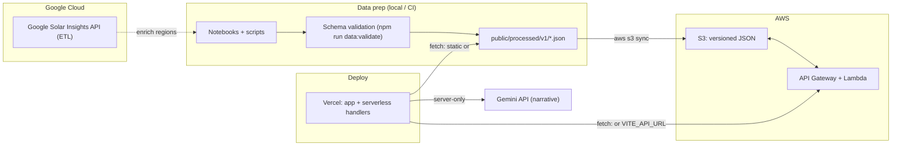

# SolarSense

🏆 **DataHacks 2026 — UI/UX Design Track Winner**

**Solar ROI intelligence for cities, utilities, and teams evaluating solar at neighborhood scale.**

**Live app:** [solar-roi-insights.vercel.app](https://solar-roi-insights.vercel.app/)

---

## What it is

SolarSense turns **neighborhood-level adoption and financial assumptions** into decision-ready insight: payback, long-term savings, CO₂ impact, and growth signals—so you can see **where solar wins fastest** and stress-test scenarios (system size, investment, utility inflation). The app pairs a **geospatial view** of regions with a **What-if** model and an optional **AI-generated executive narrative** powered by Gemini API.

---

## How to use (visitors)

1. Open the **[live site](https://solar-roi-insights.vercel.app/)**.
2. Use **Dashboard** to explore regions on the map, compare neighborhoods, and read headline metrics.
3. Adjust **What-if** controls (system size, investment, utility price increase) to see payback and projection curves update.
4. Review **environmental** metrics where shown for reporting-style context.
5. **Generate the AI narrative** (where available) to get a structured brief grounded in the current dataset.
6. Open **Methodology** for how metrics are defined and interpreted.

*Tip for demos:* pick a fast-payback area, then raise **Utility Price Increase** to show downside protection vs grid-only costs.

---

## UI/UX Design

- **Design criteria (our process)** — we optimized for: (1) **aesthetic clarity**, (2) **easy interaction**, and (3) **seamless information flow**. That led to a minimal, sleek interface that stays “dashboard readable” while still being fun to explore.

- **Step-by-step user journey (information architecture)** — the dashboard is intentionally laid out to guide decisions in order:
  - **Top**: summary statistics first (instant context)
  - **Middle**: regional exploration (map + region stats to compare neighborhoods)
  - **Bottom**: implementation controls (projection chart + What-if sliders + PDF export) to turn exploration into an action-ready plan

- **Interaction details that reduce clutter**:
  - **Expandable/interactive cards** so the default view stays clean, but users can drill down when they want more detail
  - **Live What-if sliders** that update the chart and stats immediately (tight feedback loop)
  - **Recharts-powered charts** for smooth re-rendering during interaction and live updates

- **Map experience (built to feel “alive”)**:
  - The map supports **2D + 3D modes**: Leaflet as a fast fallback, and **MapLibre + MapTiler terrain** when a key is present (`VITE_MAPTILER_KEY`).
  - Regions are rendered as **GeoJSON overlays** (Voronoi-style zone cells clipped to county land), with hover/click affordances and lightweight popovers for quick comparisons.

This approach is what earned **Best UI/UX** at the event: clear information architecture, low cognitive load, and a path from overview → drill-down → action.

---

## Technical overview

- **Cloud / backend systems**
  - **AWS S3 (versioned dataset store)** — hosts `processed/v1/{manifest,summary,regions}.json` so the app always reads a clean, scalable, cacheable source of truth
  - **AWS API Gateway + Lambda (data API layer)** — serves `/api/summary`, `/api/regions`, `/api/manifest` to the frontend; lets you evolve auth/CORS/caching without changing the app
  - **Data QA + lineage (Node validator + run logs)** — `npm run data:validate` enforces schema before publish; lineage logging makes outputs reproducible/auditable

- **GCP / AI**
  - **GCP / Google Solar Building Insights** — server-side ETL adds `solar_insights` fields (sun hours, carbon factors, etc.) without exposing keys to the client
  - **Gemini API** — server function generates an executive brief + region writeups grounded strictly in your dataset (keys kept server-side)

- **Deployment**
  - **Vercel (production deployment)** — hosts the web app + server functions; env-managed deploys with preview/prod environments
  - **Nitro** — build adapter enabling TanStack Start to deploy cleanly on Vercel

- **Frontend**
  - **TanStack Start + React (full-stack UI)** — SSR-capable app with typed server functions + fast routing for dashboard UX
  - **Tailwind + Radix UI (frontend polish)** — consistent, responsive UI components for “dashboard-grade” readability
  - **Mapping + charts (MapLibre/Leaflet + Recharts + Turf)** — geospatial exploration + trend visuals for hotspots, growth, and opportunity discovery

---

## Cloud & data flow

The stack is designed to be **scalable, reproducible, and easy to update** without pasting data into the frontend.



- **Versioned data as an interface (AWS S3)**: we treat the dataset as a stable, versioned contract (`processed/v1/...`) so multiple clients can read the same source of truth and updates are simple and safe.
- **Serverless “data delivery” layer (API Gateway + Lambda)**: the frontend talks to **API endpoints**, not bucket internals. That keeps the UI decoupled and lets you add **CORS, caching, auth, throttling, and observability** without rewriting the app.
- **Operational update workflow**: new exports are published via an automated sync (`npm run data:publish`) so the live system can refresh data without a full frontend rewrite.
- **Reliability guardrails**: every publish is gated by schema validation (`npm run data:validate`) so broken or incomplete data doesn’t silently make it into production dashboards.

More detail: `data/README.md`.

---

## Gemini API

Server-side code calls **Google Gemini** to produce a **structured narrative** (executive summary, per-region angles, risks, etc.) from the same **facts** the dashboard already uses—so output stays **grounded in your dataset** rather than free-form guessing.

- **How we use Gemini**: the dashboard compiles a compact “report facts” payload (scenario inputs + dataset-derived region stats) and sends it to a **server function** that calls the **Gemini API** and returns a structured narrative (executive summary, priorities, risks, and per-region writeups).
- **Key + contract**: you need a **`GEMINI_API_KEY`** to enable narrative generation (optional: `GEMINI_MODEL`). The response is constrained to a **strict JSON schema** and validated (inputs + output shape) so the UI can safely render it and fail gracefully if the model returns malformed output.

---

## Local development

**Requirements:** Node 18+ (or current LTS), npm.

```bash
npm install
npm run dev
```

Create `.env.local` (see `.env.example`):

- Optional: `VITE_API_URL` for AWS API, or omit to use `public/processed/v1/`.
- Optional: `VITE_MAPTILER_KEY` for MapLibre terrain when used.
- For local **narrative** features: `GEMINI_API_KEY`, `GEMINI_MODEL` (if overriding default).

**Build:**

```bash
npm run build
npm run preview
```

**Data tools:**

```bash
npm run data:validate
# Publishing to S3 (needs AWS CLI + S3_METRICS_BUCKET): see data/README.md
```

---

## Deployment (Vercel)

- Connect the repo; build command: `npm run build`, install: `npm install`.
- Set **server** env vars: `GEMINI_API_KEY` (and optional `GEMINI_MODEL`).
- Set **client** env vars as needed: `VITE_API_URL`, `VITE_MAPTILER_KEY` (baked at build time).
- Redeploy after changing any `VITE_*` variable.

**Production URL:** [https://solar-roi-insights.vercel.app/](https://solar-roi-insights.vercel.app/)

---

## Project structure (high level)

- `src/routes/` — App pages (e.g. index, dashboard, methodology)
- `src/components/` — UI including SolarSense panels, charts, map
- `src/lib/` — API helpers, solar model, server narrative function
- `public/processed/v1/` — Default dataset for dev / static deploy
- `data/` — ETL notes, validation script, S3 publish script

---
